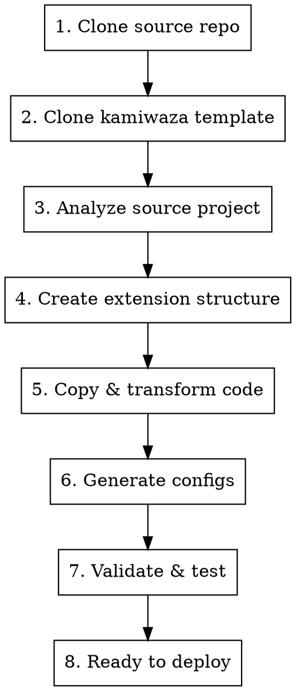
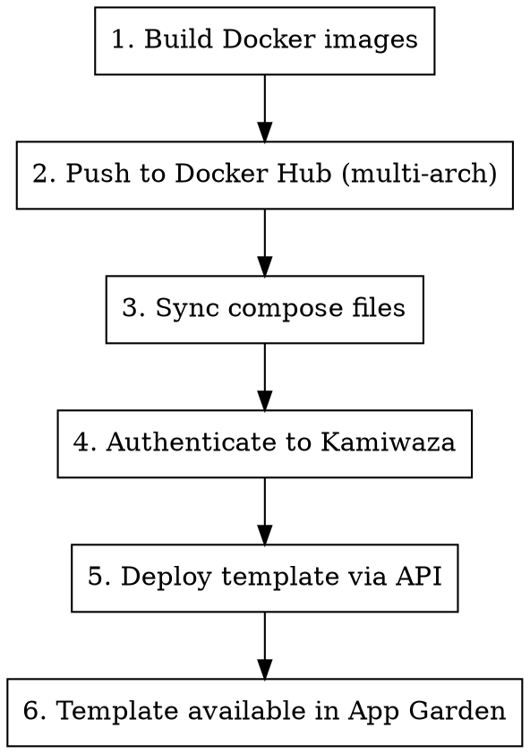

# Convert GitHub Repository to Kamiwaza Extension

One-command conversion of any GitHub repository into a deployable Kamiwaza App Garden extension.

## When to Use

- User wants to convert a GitHub repo to Kamiwaza extension
- User has cloned an external project and wants to make it App Garden compatible
- User says "convert this to Kamiwaza app" or "make this run on App Garden"
- User wants to import/migrate an external application
- User wants to deploy a converted app to a remote Kamiwaza instance
- User mentions "deploy to babynator2" or other cluster names
- User wants to publish/push an app to remote Kamiwaza

## Quick Start

```bash
# One-command conversion
python .claude/skills/kz-appgarden-converter/convert.py \
    --source https://github.com/user/their-project \
    --name my-app \
    --output ~/kamiwaza-apps/

# Or with a local project
python .claude/skills/kz-appgarden-converter/convert.py \
    --source /path/to/cloned/project \
    --name my-app \
    --output ~/kamiwaza-apps/
```

## What It Does



1. **Clone source repository** - Downloads the external GitHub project
2. **Clone Kamiwaza template** - Gets latest template from `kamiwaza-internal/kamiwaza-extensions-template`
3. **Analyze project** - Detects type, framework, architecture
4. **Create extension structure** - Sets up `apps/kamiwaza-appgarden-{name}/`
5. **Copy & transform** - Moves code, fixes Docker configs, adds health checks
6. **Generate configs** - Creates `kamiwaza.json`, updates `docker-compose.yml`
7. **Validate** - Runs `make validate` to ensure compatibility
8. **Ready** - Output is a complete, deployable Kamiwaza extension

## Usage Options

### Basic Conversion

```bash
python convert.py --source <github-url-or-path> --name <app-name>
```

### Full Options

```bash
python convert.py \
    --source https://github.com/user/project \
    --name my-awesome-app \
    --output ~/my-kamiwaza-extensions \
    --type app \
    --description "My converted application" \
    --dry-run
```

| Option | Description | Default |
|--------|-------------|---------|
| `--source` | GitHub URL or local path (required) | - |
| `--name` | Extension name (required) | - |
| `--output` | Output directory | Current directory |
| `--type` | Extension type: app, service, tool | Auto-detect |
| `--description` | App description | From README |
| `--dry-run` | Show what would be done | False |
| `--skip-validate` | Skip validation step | False |

## Output Structure

After conversion, you get:

```
kamiwaza-appgarden-my-app/
├── apps/
│   └── my-app/
│       ├── frontend/          # (if detected)
│       │   ├── Dockerfile
│       │   └── ...
│       ├── backend/           # (if detected)
│       │   ├── Dockerfile
│       │   └── ...
│       ├── kamiwaza.json      # Generated metadata
│       ├── docker-compose.yml # Transformed compose
│       └── README.md          # Updated docs
├── scripts/                   # Build scripts from template
├── make/                      # Makefile modules
├── Makefile                   # Build system
└── .ai/                       # AI assistant rules
```

## Post-Conversion Steps

1. **Review the conversion:**
   ```bash
   cd kamiwaza-appgarden-my-app
   cat apps/my-app/kamiwaza.json
   ```

2. **Test locally:**
   ```bash
   cd apps/my-app
   docker-compose up --build
   curl http://localhost:8000/health
   ```

3. **Validate:**
   ```bash
   make validate
   ```

4. **Build and push:**
   ```bash
   make build TYPE=app NAME=my-app
   make push TYPE=app NAME=my-app
   ```

## Transformations Applied

The converter automatically:

| Original | Transformed |
|----------|-------------|
| `ports: ["8000:8000"]` | `ports: ["8000"]` |
| `volumes: ["./data:/app"]` | `volumes: ["data:/app"]` + named volume |
| `localhost:8000` | `backend:8000` (service name) |
| Missing health check | Adds `/health` endpoint |
| Missing resource limits | Adds CPU/memory limits |
| Missing `extra_hosts` | Adds `host.docker.internal` |

## Supported Project Types

| Type | Framework | Conversion |
|------|-----------|------------|
| Python | FastAPI, Flask, Streamlit, Gradio | Full support |
| Node.js | Next.js, Express, React | Full support |
| Go | Gin, Echo | Full support |
| Rust | Axum, Actix | Full support |
| Docker | Any docker-compose project | Full support |

## Incompatible Projects

Cannot convert:
- Desktop GUI apps (Electron, Qt, tkinter)
- Mobile native apps
- GPU-intensive workloads (except via Kamiwaza LLM API)
- Apps requiring privileged containers

## Troubleshooting

### "Clone failed"
- Check the GitHub URL is accessible
- Ensure you have git installed and network access

### "Validation failed"
- Review the error messages
- Check `apps/{name}/docker-compose.yml` for issues
- Run `make sync-compose` to regenerate App Garden config

### "Health check failing"
- Ensure your app has a `/health` endpoint
- Check the port in the health check matches your app

## Example Conversions

### Python API → App

```bash
python convert.py \
    --source https://github.com/user/fastapi-project \
    --name api-service
```

### React + Node → App

```bash
python convert.py \
    --source https://github.com/user/fullstack-app \
    --name fullstack-demo
```

### CLI Tool → MCP Tool

```bash
python convert.py \
    --source https://github.com/user/python-cli \
    --name cli-wrapper \
    --type tool
```

---

## Remote Deployment

After conversion, deploy directly to a remote Kamiwaza instance (e.g., babynator2 cluster).

### Quick Deploy

```bash
# Deploy to babynator2 cluster
python deploy.py \
    --app-path apps/my-app \
    --cluster babynator2 \
    --password <your-password>

# Or specify URL directly
python deploy.py \
    --app-path apps/my-app \
    --url https://192.168.100.118 \
    --password <your-password>
```

### Deployment Options

| Option | Description | Default |
|--------|-------------|---------|
| `--app-path` | Path to app directory (required) | - |
| `--url` | Kamiwaza instance URL | - |
| `--cluster` | Predefined cluster name (e.g., babynator2) | - |
| `--username` | Kamiwaza username | admin |
| `--password` | Kamiwaza password (or use KAMIWAZA_PASSWORD env) | - |
| `--skip-build` | Skip Docker build step | False |
| `--skip-push` | Skip build and push, deploy existing images | False |
| `--dry-run` | Show what would be done | False |
| `--list-clusters` | List available predefined clusters | - |

### What Deployment Does



1. **Build Docker images** - Builds images locally
2. **Push to Docker Hub** - Pushes multi-arch images (linux/amd64 + linux/arm64)
3. **Sync compose** - Runs `make sync-compose` to generate appgarden compose
4. **Authenticate** - Gets access token from Kamiwaza API
5. **Deploy template** - Creates/updates app template via API
6. **Ready** - App appears in Kamiwaza App Garden UI

### Predefined Clusters

```bash
# List available clusters
python deploy.py --list-clusters
```

Currently configured:
- **babynator2** - Babynator2 development cluster (https://192.168.100.118)

### Full Workflow: Convert + Deploy

```bash
# 1. Convert a GitHub repo
python convert.py \
    --source https://github.com/user/project \
    --name my-app \
    --output ~/kamiwaza-apps

# 2. Test locally
cd ~/kamiwaza-apps/kamiwaza-appgarden-my-app/apps/my-app
docker-compose up --build
curl http://localhost:8000/health

# 3. Deploy to remote cluster
cd ~/kamiwaza-apps/kamiwaza-appgarden-my-app
python deploy.py \
    --app-path apps/my-app \
    --cluster babynator2 \
    --password <password>

# 4. Open Kamiwaza UI to create deployment
# https://192.168.100.118 → App Garden → My App → Deploy
```

### Using Environment Variables

```bash
# Set password via environment variable
export KAMIWAZA_PASSWORD="your-password"

# Then deploy without --password flag
python deploy.py --app-path apps/my-app --cluster babynator2
```

### Troubleshooting Deployment

#### "Authentication failed"
- Check username and password
- Verify the Kamiwaza URL is accessible

#### "Template has active deployments"
- Stop the deployment in Kamiwaza UI first
- Then retry the deploy

#### "Docker build failed"
- Ensure Docker Desktop is running
- Check Dockerfile syntax
- Verify buildx is available: `docker buildx version`

#### "Images not pulling on remote"
- Verify images were pushed to Docker Hub
- Check image tags match compose file
- Ensure multi-arch build was used (both amd64 + arm64)
